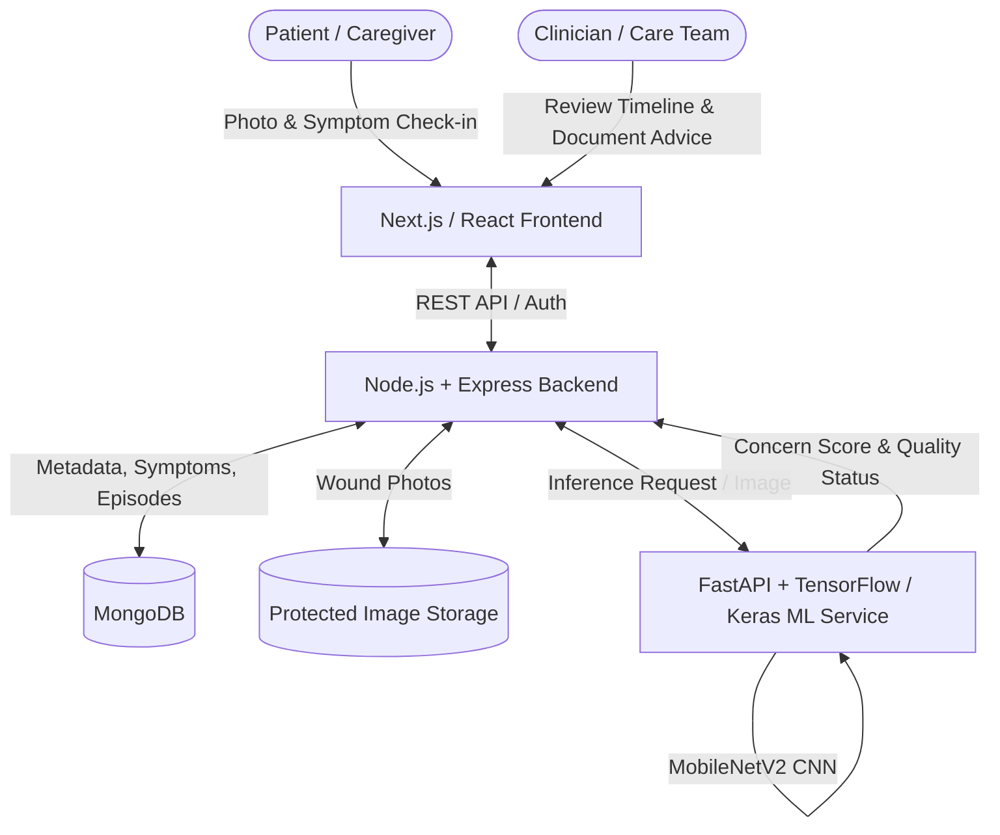

# DermaLens AI 🩺🔍
### Smart Surgical Wound Monitoring & Triage Support
> *A clearer recovery timeline. A better-informed clinical review.*

[](https://github.com/Sahil-web01/DermaLens)
[](https://github.com/Sahil-web01/DermaLens)
[](https://github.com/Sahil-web01/DermaLens)
[](LICENSE)

---

## 📌 01. Problem Statement
After surgery, patients and caregivers often struggle to communicate wound changes between follow-up appointments. Clinicians need:
- The chronological sequence of changes.
- Associated symptoms (pain, redness, swelling, cloudy drainage, fever).
- Context from previous clinical advice to properly assess concerns.

A single photograph or an isolated message provides limited context. Surgical site infections (SSIs) can involve skin, deeper tissues, or organs. **A photograph alone cannot establish or exclude an infection.** DermaLens AI bridges this communication gap by enabling structured post-discharge observations that are easier to record, review, and act upon.

---

## 💡 02. Proposed Solution & Workflow
DermaLens AI connects patient home check-ins to a clinician review dashboard through a structured 4-step workflow:

1. **Capture (Patient / Caregiver):**
   - Guided wound photo upload with a previous-photo framing overlay to ensure consistent angle and lighting.
   - User-selected crop and image quality checks.
   - Short symptom check-in questionnaire (pain level, temperature, discharge, redness spread).
2. **Organise (System):**
   - Stores entries under a dedicated wound episode.
   - Displays a chronological recovery timeline with side-by-side photo comparison.
3. **Review (Clinician Dashboard):**
   - Highlights explicit patient-reported symptom flags.
   - Flags image-quality issues (blur, lighting, retake requests).
   - Surfaces experimental CNN concern scores separately with full transparency.
4. **Follow Up (Clinical Action):**
   - Clinicians evaluate complete evidence, document clinical advice, and schedule the next check-in or urgent clinic visit.

> **⚠️ Prototype Boundary & Safety Notice:**
> DermaLens AI is designed strictly as a **clinician-support workflow tool**. Automated diagnosis, treatment selection, and declarations that a wound is "safe" are explicitly **outside the scope of this prototype**. Any symptom report of potential infection directs patients to seek immediate medical attention regardless of AI predictions.

---

## 🏗️ 03. System Architecture



---

## 💻 04. Technology Stack

| Layer | Technology | Purpose |
| :--- | :--- | :--- |
| **Web Interface** | React with Next.js, CSS | Mobile-friendly patient photo capture, forms, timeline, and clinician dashboard. |
| **Application Backend** | Node.js + Express | Authentication, access controls, wound episode state, review rules, API orchestration. |
| **Data & Storage** | MongoDB + Protected Object Storage | Metadata, symptom logs, notes in MongoDB; protected wound images stored separately. |
| **AI / ML Service** | Python, FastAPI, Uvicorn | Dedicated microservice serving model inference and image quality auditing. |
| **Model Training** | TensorFlow / Keras, MobileNetV2 | Transfer learning for image concern classification using the SurgWound dataset. |
| **Image Preparation** | Pillow, tf.image | Decode, orient, crop, resize (224x224 RGB), and normalize images with modest augmentation. |
| **Analysis & Workflow** | NumPy, Pandas, scikit-learn | Data auditing, confusion matrix evaluation, error visualization. |

---

## 🔬 05. AI / ML Scope & Dataset Plan

- **Dataset:** [SurgWound](https://huggingface.co/datasets) — 686 surgical wound images with 8 expert-annotated attributes, licensed under CC BY-SA 4.0.
- **Task Formulation:** Binary classification evaluating lower vs. elevated image-assessed concern (Low mapped to one class; Medium/High mapped to elevated concern).
- **Architecture:** Pretrained **MobileNetV2** base (frozen during initial transfer learning), global average pooling, and a custom classification head. Fine-tuning applied to select top layers if validation improves.
- **Evaluation:** Precision, Recall, F1-score, PR-AUC, and confusion matrix on held-out test data. Thresholds tuned on validation data only.

---

## 📂 06. Project Directory Structure

```text
DermaLens/
├── backend/                  # Node.js + Express API Backend
│   ├── src/
│   │   ├── config/           # Database and server configurations
│   │   ├── controllers/      # Route controllers (auth, checkin, episode, review)
│   │   ├── middlewares/      # Authentication and file upload middlewares
│   │   ├── models/           # Mongoose schemas (User, Episode, CheckIn)
│   │   ├── routes/           # Express API route declarations
│   │   ├── services/         # Integrations (e.g. ML inference client)
│   │   └── app.js            # Express application setup
│   ├── .env.example
│   ├── package.json
│   └── server.js             # API entry point
│
├── frontend/                 # Next.js / React Client Application
│   ├── src/
│   │   ├── app/              # Next.js App Router (pages & layouts)
│   │   │   ├── checkin/      # Patient photo capture & symptom check-in
│   │   │   ├── dashboard/    # Clinician review queue & overview
│   │   │   ├── login/        # Authentication page
│   │   │   ├── timeline/     # Episode chronological history
│   │   │   ├── layout.js     # Root application layout
│   │   │   └── page.js       # Landing page
│   │   ├── components/       # Reusable UI components (overlays, cards, forms)
│   │   └── styles/           # Global styles and design tokens
│   ├── .env.example
│   ├── next.config.js
│   └── package.json
│
├── ml/                       # Python / TensorFlow / FastAPI Inference & Training
│   ├── data/                 # Dataset storage (.gitkeep)
│   ├── models/               # Serialized model weights & exports (.gitkeep)
│   ├── config.py             # Hyperparameters and service configuration
│   ├── dataset.py            # Data loading, splitting, and audit scripts
│   ├── evaluate.py           # Model evaluation and metrics generation
│   ├── main.py               # FastAPI inference service
│   ├── model.py              # MobileNetV2 architecture definition
│   ├── preprocess.py         # Image preprocessing pipeline (Pillow/tf.image)
│   ├── train.py              # Training and fine-tuning pipeline
│   ├── .env.example
│   └── requirements.txt      # Python dependencies
│
├── .gitignore
└── README.md
```

---

## 🚀 07. Getting Started

### Prerequisites
- **Node.js**: v18+ & npm
- **Python**: v3.10+
- **MongoDB**: Local instance or MongoDB Atlas connection URI

### 1. ML Service Setup
```bash
cd ml
python -m venv venv
# Windows:
.\venv\Scripts\activate
# Unix/macOS:
source venv/bin/activate

pip install -r requirements.txt
uvicorn main:app --reload --port 8000
```

### 2. Backend Setup
```bash
cd backend
npm install
npm run dev
```

### 3. Frontend Setup
```bash
cd frontend
npm install
npm run dev
```

---

## 👥 08. Team & Hackathon Details

- **Event:** Global Innovation Hackathon 2026 — *Build for a Better Future*
- **Organised by:** Bharat Academix
- **Team Name:** Logic Legion
- **AI/ML Lead:** Lakshay Gauniyal
- **Repository:** [Sahil-web01/DermaLens](https://github.com/Sahil-web01/DermaLens)

---

## 📄 09. References
1. CDC. *Surgical Site Infection (SSI) Basics.*
2. TensorFlow. *Transfer learning and fine-tuning with MobileNetV2.*
3. SurgWound dataset. Official dataset card, public files and licence (CC BY-SA 4.0).
4. Xu et al. *SurgWound-Bench: a benchmark for surgical wound diagnosis (2026).*
5. Borst et al. *WoundAIssist: remote chronic wound care application.*
